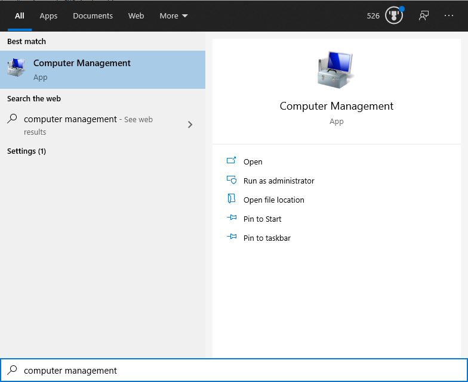
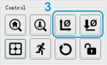

# Sainsmart-CNC-Instructions
> This is a walkthrough on how to use the Sainsmart CNC Mill in Mr. Yip's classroom. This will include all of the necessary files and instructions to operate the mill and start generating your own GCode.

## Table of Contents
* [Computer Operation](#operating-with-computer)
* [Offline Controller Operation](#offline-controller-operation)
* [Editing GCode](#editing-gcode)
* [Making Your Own GCode](#making-your-own-gcode)
* [Future Projects/Modifications](#future-projects/modifications)

## Operating with Computer
> This will walk you throught the setup on a computer to start CNC milling!
### Downloads
1. Download the [Sainsmart Original Documentation & Files](https://docs.sainsmart.com/article/7c20d7zaw3-how-to-install-candle-grblcontrol-for-windows)
2. Extract the CD.zip file with an extraction tool such as [WinZip](https://www.winzip.com/win/en/) or [7-Zip](https://www.7-zip.org/)
3. Open the extracted CD folder and navigate to `CD > 3018-PROVer Tutorial_Software_Driver > Driver` and run the `Driver_CH340SER.EXE` to install the drivers:

4. Close the window and navigate to `CD > 3018-PROVer Tutorial_Software_Driver > Grblcontrol(Candle_1.1.7)`; run the `Grblcontrol (Candle).exe` file
5. Boom you now have everything you need to start the CNC mill!

### Starting the CNC Mill
1. Plug in the computer that will be running the GCode with the attatched USB cable and power on the CNC
2. On your computer, press the `Windows Key`, search "Computer Management", and select the first option: 

3. Under Device Manager, you will see a `Ports (COM & LPT)` dropdown; here you will see the COM number of the CNC... remember this

4. In the `Candle` program, navigate to `Service > Settings` in the top left
5. Input the COM number that you memorized earlier and press `OK`
6. Your computer is now connected! (in the console, you should see something like [CTRL + X] which indicates a connection)

### Milling
1. To import GCode, press `File > Open` in the top left and select the GCode that you want to run

> *There is some test GCode in `CD > 3018-PROVer Tutorial_Software_Driver > Gcode` that you can try*

> *You can also download more test files [here](https://drive.google.com/drive/folders/1tbcUEpciVWc9IrO-3qc5D1uYymUoVKXO)*

2. Now insert a drill bit into the chuck of the mill making sure that it is tightly secured with the included wrenches
3. You will now want to line up the bit using the on-screen buttons, to where you would like the GCode to start

> *When aligning the drill bit, you will want to put the bit touching the work surface*

> Step = how far the mill moves (for small movements use 1-10)

> Feed = how fast the mill moves (1000 is fine)

4. Once aligned, home the mill with these two buttons:

5. You can now press `send` on the bottom of the window to start the milling process

> *Do not be afraid to press pause or abort because you think there is something wrong*

6. Odds are you probably need to change the feed rate or the spindle speed of the mill after your initial run...
To do this, you will want to click on the GCode where you see either `F###` or `S###`;

> F = Feed Rate

> S = Spindle Speed

> Simply change the numbers after the corresponding letter to adjust the speeds and resend the GCode

6. Once you are happy with the settings then let the mill do its thing!

## Offline Controller Operation
> Using the offline controller is a lot easier than using the computer, but does not allow for as much flexibility when it comes to testing GCode and adjusting values

### Importing GCode
To import GCode to the offline controller, either use the USB cable connected to the controller and the computer to drag over the files, or take out the SD card in the offline controller and put the files on that

### Milling
1. Plug the offline controller into the CNC using the included ribbon cable and then power on the mill
2. On the offline controller, click control and there you can position the CNC to the starting home position

> To change the step size, press the Exit/Step button

> To exit the control interface, press and hold the Exit/Step button

3. Navigate to the File page and there you can select the GCode that you want to mill from
4. Press OK on the file that you want to mill and then press OK one more time
5. You should be milling!

## Editing GCode
> Nothing was provided with the mill to edit GCode so we found our own software

[GCode Ripper](https://www.scorchworks.com/Gcoderipper/gcoderipper.html)

To use this, you simply launch the executable and import the GCode that you want to edit

You may have to hop back and forth between this and Candle to get your sizing right but it's the best solution that we found

## Making Your Own GCode
> We didn't get too much time trying to figure out how to make our own GCode, but here I can teach you what we learned :)

### Easel
We ended up using [Easel](https://www.inventables.com/technologies/easel) to make some of our own GCode which is a pretty straightforward program to use.
Just make an account and once you are in you can start toying around with your own designs. If you do end up using easel, you will have to download easel drivers so that you can use the CNC straight from their program instead of Candle.

### Fusion 360
We didn't get much of a chance to play around with Fusion, but it was something that we were looking at while setting up and using the mill.

If this is on a personal computer, you will want to download an educational lisence of Fusion 360, and make sure that you download the CAM package with it. Once in Fusion, you can start playing around with creating your own designs and starting to mill 3D objects. As stated before, we didn't really have enought time to explore this, so you will have to toy with it to learn how to use it or find your own resources elsewhere online.

## Future Projects/Modifications
1. The clamping mechanism for the mill is quite jank, so 3D printing a vice for the mill or another method of clamping is a pretty good idea. You could also mill something made out of aluminum too to make something more robust
2. The cable management of the mill is a little... non-existant, so using some zipties or secureing the cable-wraps to the cables might be needed
3. There is a lot of vibration in the mill so the addition of rubber feet to the bottom of the mill may help with the vibration and the sound
4. The lead screws for the mill aren't lubricated so adding something like graphite or something else will reduce any stutters or squealing that comes from them
5. 3D printing something that can hold a vacuum so that you can blow or suck up any shavings/debris that come from the milling process 
